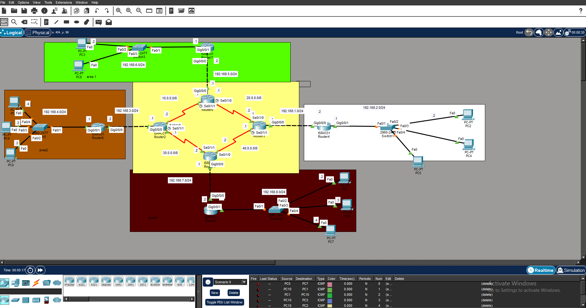

# Multi-Area OSPF Enterprise Network Design

## 📝 Overview
This project demonstrates the design and implementation of a scalable, high-availability enterprise network using the **Multi-Area OSPF (Open Shortest Path First)** routing protocol. The topology is built and simulated using **Cisco Packet Tracer**, connecting multiple distinct logical zones (Areas 0 to 4) to optimize routing efficiency, reduce OSPF overhead, and ensure fast network convergence.

---

## 🌐 Network Architecture
The network is divided into **5 OSPF Areas** to localize routing updates and minimize the size of the Link-State Database (LSDB):

* **Area 0 (Backbone Area - Yellow):** The core of the network, consisting of 4 interconnected routers forming a redundant loop to ensure high availability and prevent single points of failure.
* **Area 1 (Green Zone):** Represents a regional branch/department connected to the backbone via an Area Border Router (ABR).
* **Area 2 (Orange Zone):** Another enterprise branch with dedicated local subnets and end-user devices.
* **Area 3 (White Zone):** A LAN segment handling local user traffic, connected directly to the core.
* **Area 4 (Dark Red Zone):** A branch network incorporating local switching and multiple end-hosts.

---

## 🛠️ Features & Technologies Used
* **Routing Protocol:** Multi-Area OSPFv2 for dynamic, scalable, and fast-converging routing.
* **Redundancy:** Dual-link and loop topologies in the core (Area 0) to guarantee path redundancy.
* **IP Addressing & Subnetting:** Efficient allocation of IP addresses across different subnets (utilizing Class C and core point-to-point links).
* **Hardware Simulated:** Cisco ISR 4331 Routers, Cisco 2960 Switches, and various PC end-devices.
* **Connectivity:** Full End-to-End connectivity verified via ICMP (Ping).

---

## 📸 Topology Screenshot

---

## 🚀 How to Run the Project
1. Download and install **Cisco Packet Tracer** (v8.x recommended).
2. Clone this repository or download the `.pkt` file.
3. Open the file inside Cisco Packet Tracer.
4. Wait for the link lights to turn green, then test connectivity using the `ping` command or the Simulation Panel between any PCs.
